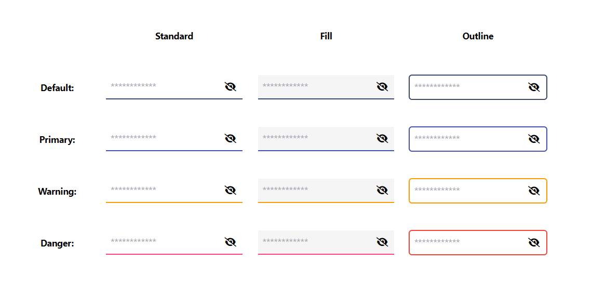
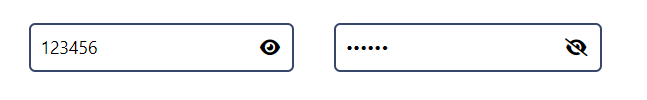

Password Input (Generated via Stencil)

Inputs:

value --> input value

placeholder --> input placeholder

appearence --> standard || fill || outline

color --> default || primary || warning || danger

Outputs:

valuechange --> Emits the value whenever it changes.

